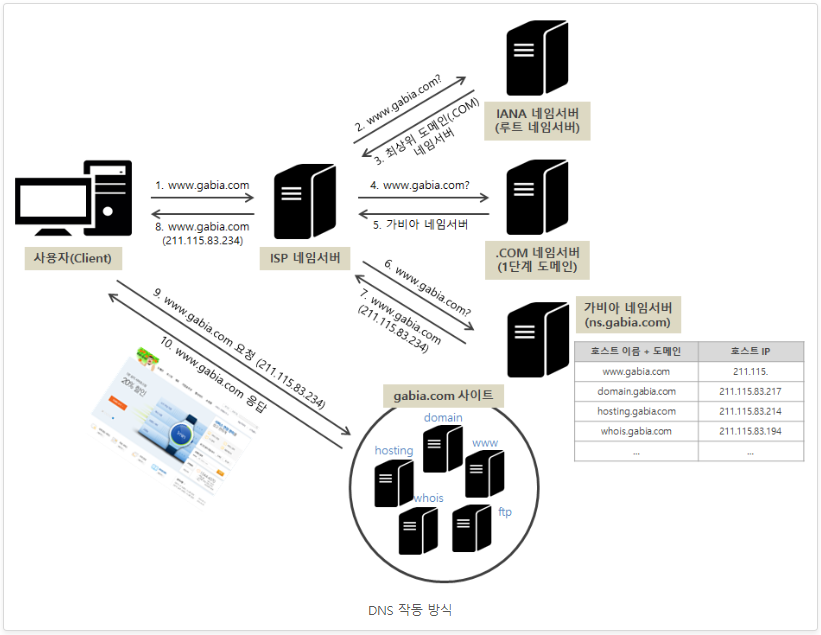
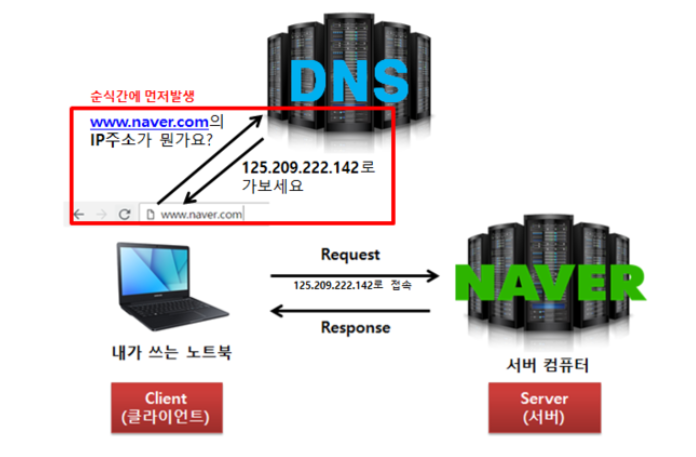
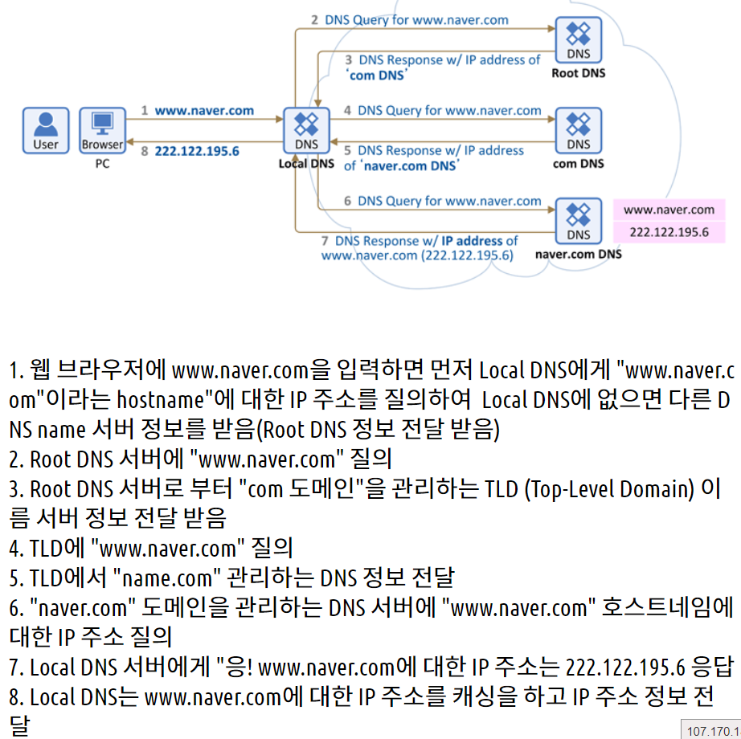
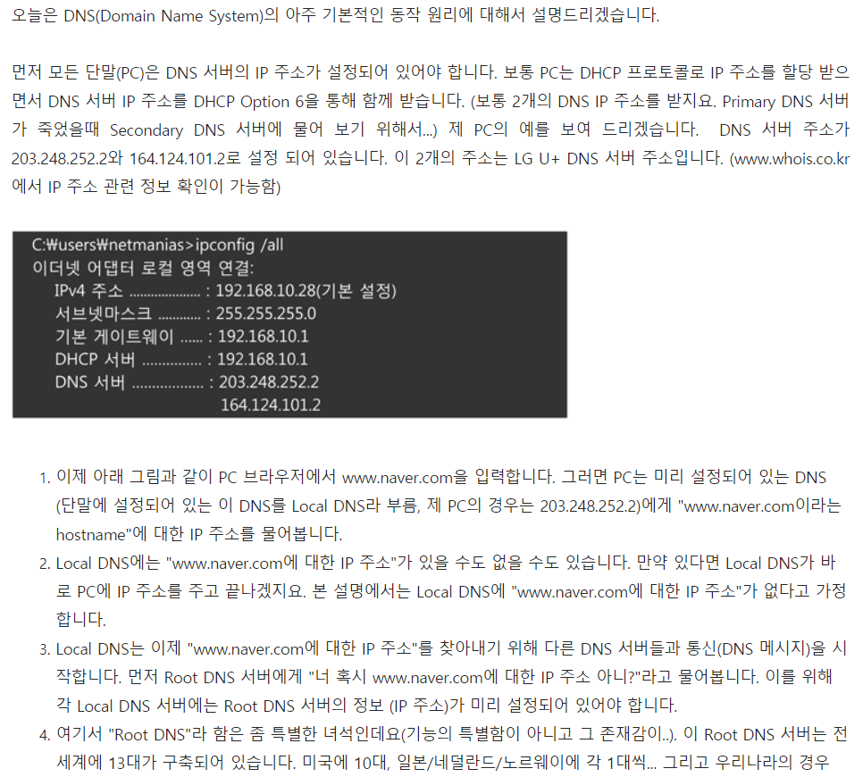
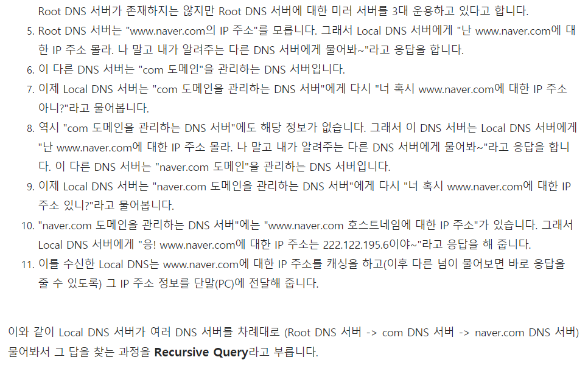
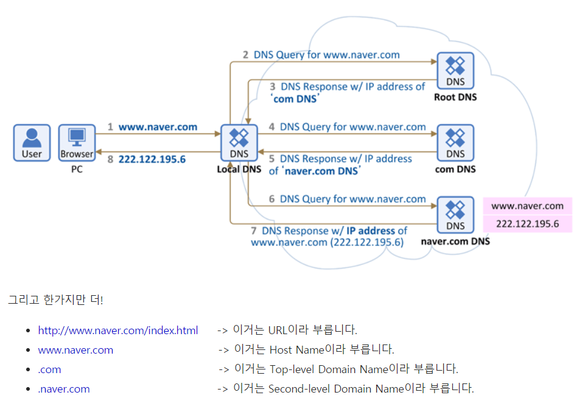

## 도메인과 호스팅연결(네임서버) , 브라우저 도메인입력시 DNS,네임서버 실행원리 , DNS와 네임서버 개념

### <1> 도메인을 구입하고, 호스팅 서버를 구매하여 서로 연결하는 과정에서의 개념이해와, 네임서버의 역활

1. 도메인을 구입하게 되면, 말 그대로 껍데기의 모양을 구매한것이다.

2. 서버는 ip주소가 있다. 즉, 호스팅 업체에서 호스팅서버를 임대하면, 고유의 ip주소가 만들어지게 된다.

3. 호스팅서버를 임대했다면, 해당 서버에 도메인을 연결해야한다.(카페24는 그냥 도메인 입력하고 연결하는것만으로 끝인것같다.)
    (해당 호스팅 서버에 도메인 연결을 하는 이유는, 후에 브라우저에 도메인 입력하였을때, 해당 도메인에 연결된 네임서버로 접속하는데, 그 네임서버에서 브라우저에 입력한 도메인과
    같은 도메인으로 등록된 호스팅 서버를 찾기 때문이다.)
    
4. 마지막으로, 도메인을 구입한 곳에서 네임서버를 호스팅 서버를 임대한 업체의 네임서버를 입력해주면 된다.

     

### <2> 브라우저에 도메인을 입력하였을시의 전체과정과 DNS와 네임서버의 이해

[사진 링크, 추가보완내용도있다. : http://library.gabia.com/contents/domain/4146]

[여기서 1번-10번은 그림의 1-10을 의미]
1. 브라우저에 도메인 입력시 맨 먼저 도달하는 ISP 네임서버는 통신사(SK,KT,LG)의 관할이다.   
    [이를 추가로 설명해주는 링크 : https://grapherstory.tistory.com/238]
    [보충내용 : 만약 1번과정에서 ISP 네임서버에 www.gabia.com의 최근 방문 기록이 남아있는 경우, 즉 www.gabia.com의 호스트 정보를 가지고 있는 경우에는
    곧바로 가비아의 www.서버를 찾아 접속이 가능하다.(즉, 1번에서 바로 8번 과정으로 가는것) 대부분의 네임서버 제공 업체에서는 '캐시 서버'라 하여
    한 번 방문이 있었던 웹페이지의 정보를 일정 시간 저장하였다가 재요청이 있는 경우 즉시 응답하는거다.]
    
2. 그리고 차례대로 2번부터 7번까지의 과정을 거쳐서 다시 ISP네임서버에 해당 요청도메인(1번)에 대한 ip주소를 전달해주고 이를 다시 사용자(Client)에게 전달해준다.

3. 여기서, 6번으로 들어가면 가비아 네임서버라고 적혀져있는건, 내가 검색한 도메인에 연결된 네임서버를 의미한다.
    여기선, gabia.com의 도메인의 네임서버가 ns.gabia.com으로 연결되 있기 때문에 저렇게 뜬거다.
    [즉, 우리가 도메인을 어느 네임서버에 연결하냐를 따질때의 그 어느 네임서버가 여기 연결되는거다.]

4. 그러고나서, 해당 ip주소를 네임서버를 통해받은 사용자는 이를 브라우저(chrome,IE,...)를 통해 해당 받은 ip주소로 접속하여 그 주소의 파일들을 띄우게 되는것이다.

[추가이해]
* 여기서보면, 그리고 다른 그림이나 정부의 불법유해사이트 차단 원리 url을 보면 여러 네임서버의 과정을 총괄해서 DNS라 부르며, DNS에는 여러 종류의 네임서버가 있다.
[링크 : https://grapherstory.tistory.com/238]
* 브라우저(IE,크롬)는 다른 네임서버로(최초 ISP네임서버로)의 연결과 그리고 네임서버에서 받은 ip주로를 찾아가 해당 서버의 파일을 보여주는 역활인거다
* 네임서버와 DNS의 존재이유는 도메인이 생겨났기 때문이다. 즉, 도메인이 없고, ip주소만으로 사람들이 생활한다면 DNS와 네임서버는 필요하지 않게된다.
* DNS의 실제 과정은 위와같지만, 결국 기능은 도메인 입력시 ip주소를 사용자(client)에게 알려주는것이기 때문에 대부분 모든 사람들이 DNS와 네임서버의 기능을 이와 같이 말하는거다.
* 또한, 과정 1에서부터 8까지를 DNS서버의 작동 방식으로 보고 이 자체를 DNS서버로 보기때문에 네임서버는 그 안에서 작동하는 서버로 보면된다.
* DNS, 네임서버는 모두 ip주소를 갖고있다.
* DNS와 네임서버는 모두 도메인이 생겨났기때문에 존재하는거다. 즉 ip주소만 있다면, DNS와 네임서버는 필요하지 않다.(링크 : https://xetown.com/topics/1125037)
* 네임서버를 DNS라 보기도하며, 네임서버들의 모든 통과정을 DNS로 보기도 한다.
* DNS레코드를 입력하는 란은, 도메인업체와 호스팅업체 둘다 갖고있다.(명시)

#### 추가사진

    

      
[추가 DNS 원리 이해] 1.

링크 : https://ijbgo.tistory.com/27

[추가 DNS 원리 이해] 1.

링크 : https://www.netmanias.com/ko/post/blog/5353/dns/dns-basic-operation