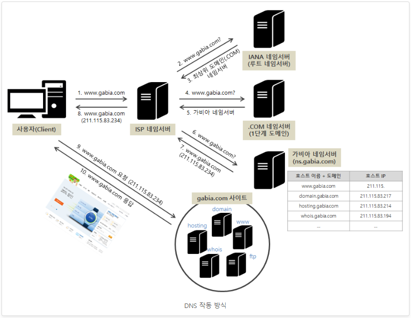

## 추가 서브도메인 쿼리 원리

일반, 도메인을 브라우저에 입력했을때와는 다르게, 서브도메인을 브라우저에 쳤을때 그 ip주소를 받아오고 적용되는 원리를 설명하겠다.

   

(1). 이곳에서 1번에 보면, 브라우저에 www.gabia.com이라고 쳤다. 그런데, 우리가 네임서버를 입력한건 루트도메인 뿐인데, 서브도메인은
네임서버를 어떻게 찾아갈까?   
-> www.gabia.com이라고 브라우저에 쳤는데 네임서버를 찾아가는거보면, 애초에 서브도메인에는 루트도메인에 등록한 네임서버정보가 같이 등록되어,
서브도메인을 입력하여도 루트도메인의 네임서버를 찾아가는거다.

(2). 그렇게해서, 6번과정에서 네임서버에 쿼리가 도착하면, 해당 네임서버에서 서브도메인에 해당하는 ip주소값을 반환해준다.
(루트도메인의 서버ip주소를 받아올때와 같다.)

즉, 서브도메인은 두가지의 추가기능이 있는데,
    [1]. 네임서버에 서브도메인이 등록됬다 하더라도, 브라우저에 서브도메인을 쳤을시, 루트도메인 쳤을때와 똑같이 작동하여, 서브도메인에 입력된
    네임서버를 찾아간다.
    [2]. 서브도메인은 따로 네임서버를 입력하지 않아도, 브라우저에 서브네임 입력시 알아서 루트도메인에 등록된 네임서버와 같은 네임서버를 찾아간다.

즉, 결론적으로 서브도메인의 ip주소를 받아오는것은 루트도메인과 같은방식이다.

*추가로 : 서브도메인은 일반루트 도메인과 같이 독립적인 도메인이다.