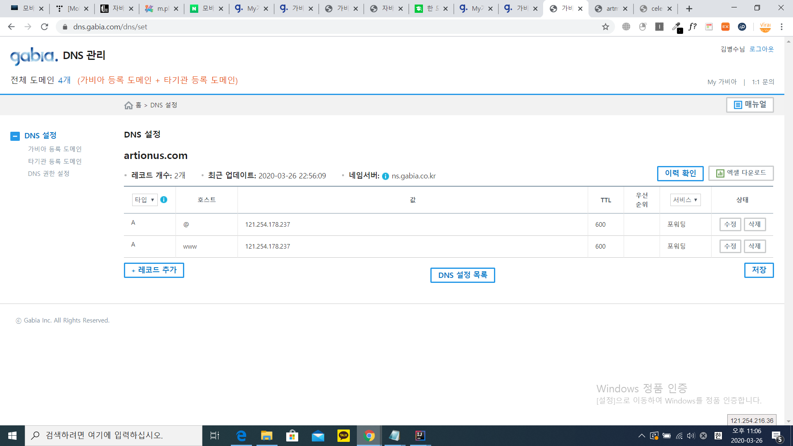

## 도메인 블로그연결, 파킹, 포워딩 개념

1. 파킹 - 서버에 암것도 안올라가 있는것을 임시화면으로 대처해주는것 이것도 원리 조금만 보기

2. 도메인 포워딩 - 보유하고있는 도메인을 특정사이트로 연결해주는 서비스      
    [참고로, 도메인 판매 업체에서 제공해주는 서비스로, 연결하려는 도메인들은 네임서버가 해당 도메인 판매 업체로 되어 있어야 한다.]
     그 이유와 전반적인 과정이해
     
        1. 고정or유동포워딩 하면 도메인에 대한 DNS 레코드값이 특정ip를 가리키는데, 설정하려는 도메인 업체의 DNS설정에서 이루어지기 때문이다. 
        그래서 네임서버가 해당 도메인업체로 되어 있어야 한다. (포워딩설정시, DNS설정에서 단순 DNS레코드 특정ip를 가리키는것이 아닌 포워딩 전용 설정으로 등록된다.[포워딩/DNS설정 으로 나눠짐] 
        
        2. 즉, DNS설정에서 애초에 포워딩으로 등록되기 때문에, 애초에 브라우저에 해당 도메인 치면, 네임서버에서 받아와 해당 ip주소를 받아와서 접근하는 방식과 
        적용되는 방식이 포워딩에 맞게 되어있다. (애초에, DNS설정에서 DNS설정/포워딩중 포워딩으로 용도가 다르기 때문이다.)
        
        3. 그럼, 설정된 ip주소로 접근할때, 도메인업체에서 설정한(유동포워딩,고정포워딩, 사이트 제목, 검색키워드)값들이 적용이되면서, 
        고정포워딩은 고정포워딩에맞게 홈페이지가 셋팅이되것이 보여지고, 유동포워딩은 유동포워딩에맞게 홈페이지가 셋팅된것이 보여지게 된다.
         
        * 고정포워딩은 해당 홈페이지 열었을때, ip주소가 보이지않고, 유동포워딩은 보여지는 홈페이지 자체의 ip주소가 보여진다.
        * 고정포워딩은 frameset방식, 유동포워딩은 redirection 방식이다.
        [링크 : https://aty.kr/support/faq/seq/68]
        [링크 : https://webtip.tistory.com/entry/%EA%B3%A0%EC%A0%95-%ED%8F%AC%EC%9B%8C%EB%94%A9-%EC%9C%A0%EB%8F%99-%ED%8F%AC%EC%9B%8C%EB%94%A9-%EC%86%8C%EC%8A%A4]
        
        * 유동or고정포워딩 설정시 DNS설정에서 자동으로 A타입으로 설정되는 ip주소값은 일정하다.[이 부분 나중에 필요할시 더 자세히 보자]
        추가로 : 내가 임의로 특정 도메인을 고정포워딩 또는 유동포워딩 설정시 DNS설정에 입력되는 ip주소(121.254.178.237 - 고정포워딩 or 유동포워딩 설정시 항상 입력되는 DNS설정 A타입 값)로 해도 들어가지지않았다.
        
        (이 부분들은 고정포워딩, 유동포워딩 설정시 동일하게 일어나는 현상이다.)
        
        <참고사진>
        
    
    (1). 고정 포워딩
        설명 : 고정포워딩 가비아 설정에서는, A와B라는 사이트가 있을때, 본 도메인은 B라 할때, A로 접속시에 화면은 B로뜨고 도메인이름은 A로 유지된다할때, A도메인 설정에서 고정포워딩 설정을 해야하는거다.
        원리 : 
            1.고정포워딩 설정은, 내가 고정하려는 도메인을 구매한 업체에서 하는것이다.
            2.고정포워딩 설정시, DNS레코드에 www 와 @가 A타입으로 특정 ip값이 설정된다.(신기하게, 고정포워딩 설정시 www도 DNS 레코드 설정이된다.)
            3.특정 ip란, 내가 띄우려는 화면의 서버ip주소가 아니다. 이는 [1].어느 도메인을 포워실 설정하던, [2]. 유동포워딩 설정을 하던, 항상 ip주소가 같은게 뜬다.
            [본래, 호스팅서버에서 도메인연결을 한것 외의, 서브도메인이나 아니면 서버ip주소로의 접근은 막아놓게 기본설정이 되있는데, 위의 3번방식으로 하니 네이버를 제외한 coronalive.site와
            더쿠, 인스티드, 디시인사이트 전부 고정포워딩으로 접속이 됬다. 서버에서 서브도메인이나 서버ip주소로의 접근은 막아놓았지만, 이런 고정포워딩이나 유동포워딩의 접근은 서버측에서 기본으로 허용으로 해놓은것같다.]
            (네이버 설정하는거 확인), 그리고 디시인이나 더쿠 인스티즈 서버ip주소로 접근가능한지 확인- 네이버, 더쿠,인스티즈는 되고 , dc인은 안됨)       
            4.즉, DNS 레코드에서 설정되는 ip값은 해당 고정포워딩 신청한 도메인업체에서 처리해주는것으로, 다른 방식과는 다르게 화면에 띄우는 홈페이지의 서버에 접근하게 해주나보다.
            [근데 서버에서 이 고정아이피로의 접근도 따로 막을 수 있다. - ex)네이버, 더쿠+인스티즈+디시인은 안막음]
            
            추가
            * 고정포워딩으로 들어가서 해당 홈페이지의 다른글들을 클릭하면, 도메인도 경로에 따라 달라져야하는데 그대로 고정포워딩 url그대로 간다.
            [링크 : http://www.vnote.kr/index.php?mid=MEMO&category=3984&document_srl=1874]
            * 회원가입, 로그인, 회원가입 등이 있는 경우 오류가 날 수 있어 사용하지 않는것이 좋다.(이럴땐, 유동포워딩 사용하는게 좋다.)
            * 고정포워딩의 도메인으로 접속시 방식은, 
                    <frameset ~>
                        <frame ~>
                        <frame ~>
                    </frameset>
              으로, frameset과 frame태그를 사용하는 방식이다.(화면을 나누어서 보여주는 방식) - HTML5에서는 지원하지 않으나, 예전에는 썻다.
              링크 : https://blog.naver.com/shineceo97/221511603741 , https://blog.naver.com/silro812/221521009431
              
            .
            
    (2). 유동 포워딩 - 
    
    [주의할점] - 고정포워딩시에, 머가 안된단다.
    그럼, 만약 같은 도메인업체가 아닌 다른거는 어떻게 설정하나?
    타이틀같은거는 어떻게되는건가.
    유동 고정 , 방식
    고정포워딩으로 naver.com연결했더니, 네이버측에서 거절했다고 나온다.(작동원리 알기)
    엥, 뭐야 고정포워딩으로 coronalive.site했는데, artionus.com들어가니 coronalive.site뜬다.(애초에, 이거 다른곳에서 들어오는건 막는거 아니였ㄴ?) 근데 DNS레코드가 뭔가 이상한거같다. 그전꺼랑 다 같은데?   
    아, 121.254.178.237 로 어떠한 도메인으로 포워딩하던간에, 이 ip주소로 dns 레코드 등록되는데,
    
 

    
    
    유동포워딩 네이버, 된다. 디시인, 더쿠 다된다.
    
    근데 저 , 검색 키워드 , 사이트제목, 통계 이거 각각 뭐야?
    
    로그인,회원가입 기능 등이 있으면 유동포워딩으로 해야한다. 고정포워딩으로하면 에러날수도있다.
    
    엥 모바일 파킹머지, M.도메인으로 된다는데,
    
    
3. 도메인 연결(블로그,스마트스토어등) [BUT, 네이버는 이제, 블로그 도메인연결을 2020년 12월 31일까지만 지원한다함, 그 이후로는 도메인 연결을 지원안한다함]
    - 내가 구입한 도메인이 어디부터 어떻게 표시되는진 모르겠으나, 원리는 아래와같다.

    원리.
    1. 가비아는 네이버블로그연결을 한다하면, DNS레코드에 A타입으로 IP주소값이 네이버 블로그 공식ip주소가 설정된다.
    2. 네이버 블로그에서는 사용하려는 도메인을 등록해주면 된다.(아마, 네이버블로그 서버에서 도메인등록시 연결을 해주는것같다.)

    
    
    
    그럼 혹시, 이 m 서브도메인 이용안하고, 그냥 자바스크립트로 모바일,pc알아서 나오게 하려면, 고정포워딩을 쓰는건가?
    
    엥 그러고보니, 백엔드 측이 아니더라도 자바스크립트로 유동 or 고정 포워딩 설정할수있잖아
    
    그리고 네이버블로그 연결시 유동인지 고정인지
    
    엥, 호스팅업체 서버ip주소가 페이지별로 다 다른가? 아닌데? 인스티즈보니까
    그런데, 어떻게 A레코드로, (도메인.com/m를) ip주소값을 넣어서 설정하지?
    
    아니, 그러면, 서브도메인 m.도메인.com을 dns 레코드 추가하고 CRNAME인가 뭔가로 도메인.com/m로 연결해서 사용하는건가?
    그리고 애초에 처음 웹사이트 들어왔을때, 백엔드단이나 자바스크립트로 기기 검색해서 만약 모바일 기기이면,
    m.도메인.com으로 href되게 하는건가? (그럼, 1.서브도메인은 유동,고정이 아니라 그냥 그 자체로 도메인인거고, 2.모바일기기인지 확인하는 방법은, 자바스크립트나 백엔드단에서 하는거겠네, 3.그리고,
    dns레코드할때, m.도메인.com을 A레코드는 못하고 그럼 CNAME밖에 안되는건가?(도메인.com/m을 뭔수로 A레코드로 연결시킬건데?))
    
    아니, 그리고 시바 네이버는 m.naver.com과 www.naver.com ip주소가 다른데, m.playsongs.co.kr과 playsongs.co.kr이 아이피 주소가 같다.
    아예, m.naver.com은 다른 서버에서 관리하고 있다는 뜻일까, 디시인도 다르다. 더쿠는 모바일,pc 도메인이 모두 같은데
    각각 모바일이나 pc 아이피주소가 같다.
    
    1. 우선 서브도메인은 유동포워딩이나 고정포워딩같은것이 아니다.(고정포워딩에 가깝다해야 하나?)?
    아니 그럼 모바일과 pc가 화면이 다른데, ip주소가 같다는건 같은서버에서 파일경로만 다르게 표시해주고(이 경우, CNAME 레코드로 도메인경로로 해주고    )
    근데 나는 더쿠도 모바일,피시 같이 ip주소인데, dc인은 다른ip주소라쳐도, 그러면은 비용or속도면에서 딱히 나는 나눌 필요가 없는것같은데.
    
    그리고 m.naver.com , m.playsongs.co.kr은 도메인 치면 그냥 들어가지는데, m.instiz.net은 pc에서 치면 그냥 instiz.net으로 재 연결된다.
    이건 그냥, 자바스크립트나 백엔드단에서 pc 기기확인하고 보내는거겠지?
    
    [1]. 특정도메인A를 도메인 연결에서 네이버로의 연결을 설정하면, 자동으로 가비아에서, 도메인A의
         DNS 레코드 설정에서 1.A타입으로 2.호스트는 @와 www로 3.값은 "네이버 블로그ip주소" 로 4.ttl은 600으로 설정된다.
         
    [2]. 네이버 블로그에서는, 주 사용 주소를 개인 도메인으로 설정하고, 도메인A를 입력하여야한다.
                         